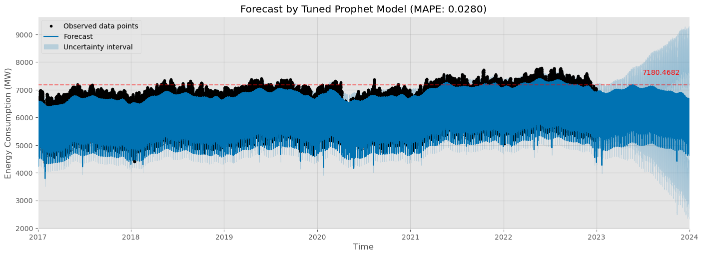

# Time Series Forecasting with Prophet

## Introduction

Singapore has seen much progress in the energy sector, transitioning from the use of oil to natural gas over the past decades and also gradually introducing other alternative sustainable energy sources such as solar. The effects of climate change have become more pronounced and could severely impact our small island state if kept unchecked. With the target of zero net emissions by 2050, the energy sector needs to reduce emissions while ensuring supply keeps pace with the growing demand.

This creates a need for an accurate forecasting model that can accurately predict energy demand over a 365 day forecast horizon. This allows sufficient buffer for planning of new energy infrastructure projects to ensure that future energy demands can be met, ensuring stability of the overall energy network.

## Data

Data for this project is scraped from the [Energy Market Authority](https://www.ema.gov.sg/index.aspx) of Singapore statistics for half-hourly system demand data and consolidated into a [dataset](https://www.kaggle.com/datasets/eeshawn/half-hourly-electrical-demand-in-singapore).

## Data Dictionary

| Column | Type | Description |
| :-: | :-: | --- |
| ds | datetime64 | Timestamp in 30 minute intervals |
| y | float | Historical electricity system demand in MW |

## Modelling

`Prophet` is an open source tool released by Facebook for forecasting time series data, and is meant to be straightforward and easy to use. It is based on an additive model where trends are fit with daily, weekly and yearly seasonality, and can also account for holiday effects, which should be very applicable to this use case with electrical demand.

## Evaluation

Prophet achieved a **3.67% MAPE** when predicting for January 2023, when trained on data from 2017 - 2022.

## Future Work

While the model appears to have achieved a high fit with our historical data, it is important in time series forecasting to ensure that the model is able to perform well in production. This could involve constantly evaluating the forecasts against the actual demand as time passes, otherwise the high degree of accuracy in predicting historical data could just be our model overfitting to seen data and having low actual forecasting ability.

In a future version of this project, it would be interesting to compare Prophet's performance against other models:

- Traditional statistical models such as seasonal ARIMA
- Supervised machine learning algorithms such as XGBoost or LightGBM
- Deep learning Recurrent Neural Network (RNN)

## Recommendations

With the model forecasting that electrical demand may remain approximately the same as in 2022, this could suggest that some of the agency's efforts in reducing energy demand through encouraging energy efficiency has been effective. However, note also that there is a high level of uncertainty given our long prediction horizon. As with most time-series models, the model will need to be retrained often using the latest available data in order to maintain its performance.

## References

- The Future of Singapore's Energy Story. Energy Market Authority of Singapore. (n.d.). Retrieved March 3, 2023, from https://www.ema.gov.sg/ourenergystory 
- Merwe, R. van der. (2018, November 15). Implementing facebook prophet efficiently. Medium. Retrieved March 3, 2023, from https://towardsdatascience.com/implementing-facebook-prophet-efficiently-c241305405a3 
- Monigatti, L. (2022, August 23). Time series problems simply explained as fast food combo meals. Medium. Retrieved March 3, 2023, from https://towardsdatascience.com/time-series-problems-simply-explained-as-fast-food-combo-meals-70c6eb9bdef 
- Vasselin, H. (2022, March 17). Is Facebook prophet suited for doing good predictions in a real-world project? Medium. Retrieved March 3, 2023, from https://medium.com/artefact-engineering-and-data-science/is-facebook-prophet-suited-for-doing-good-predictions-in-a-real-world-project-44be1fe4ce91 
